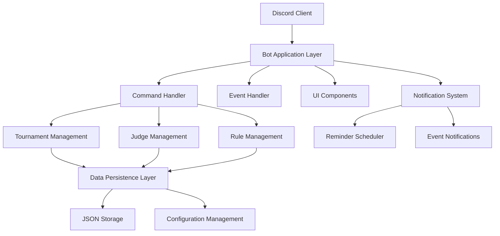

# Design Document

## Overview

The ICF-Tournament-Bot is architected as a modular Discord bot using discord.py 2.3+ with a focus on reliability, scalability, and maintainability. The system employs an event-driven architecture with persistent data storage, role-based access control, and comprehensive error handling. The bot serves as a centralized tournament management platform that integrates seamlessly with Discord's native features while providing specialized tournament functionality.

**Last Updated:** September 7, 2025  
**Version:** 3.0.0  
**Architecture Status:** Production-ready with simplified two-role permission system

## Architecture

### High-Level Architecture



### Core Architectural Principles

1. **Separation of Concerns**: Each module handles a specific domain (tournaments, judges, rules)
2. **Event-Driven Design**: Reactive system responding to Discord events and user interactions
3. **Persistent State Management**: All critical data persisted to prevent data loss
4. **Graceful Error Handling**: System continues operation despite individual component failures
5. **Role-Based Security**: Access control integrated at the command and interaction level

## Components and Interfaces

### 1. Bot Application Layer (`app.py`)

**Responsibilities:**
- Discord client initialization and configuration
- Global event handling and bot lifecycle management
- Command tree registration and synchronization
- Integration point for all subsystems

**Key Interfaces:**
```python
class ICFTournamentBot(commands.Bot):
    def __init__(self)
    async def setup_hook(self)
    async def on_ready(self)
    async def on_error(self, event, *args, **kwargs)
```

### 2. Tournament Management System

**Responsibilities:**
- Match scheduling and event creation
- Team coordination and communication
- Tournament progression tracking
- Integration with Discord channel management

**Key Components:**
- `EventScheduler`: Handles match creation and timing
- `ChannelManager`: Manages dedicated match channels
- `TeamCoordinator`: Handles team captain communications

**Interfaces:**
```python
class EventScheduler:
    async def create_match(self, team1_captain, team2_captain, match_time)
    async def update_match(self, event_id, updates)
    async def cancel_match(self, event_id)

class ChannelManager:
    async def create_match_channel(self, event_id, participants)
    async def add_participant(self, channel, user, permissions)
    async def remove_participant(self, channel, user)
```

### 3. Judge Assignment System

**Responsibilities:**
- Judge workload management and assignment tracking
- Interactive schedule taking/releasing interface
- Judge capacity monitoring and enforcement
- Permission management for match channels

**Key Components:**
- `JudgeAssignmentManager`: Core assignment logic and persistence
- `TakeScheduleButton`: Interactive UI component for judge actions
- `WorkloadTracker`: Monitors and enforces judge assignment limits

**Interfaces:**
```python
class JudgeAssignmentManager:
    def can_judge_take_schedule(self, judge_id, max_assignments) -> tuple[bool, str]
    def add_judge_assignment(self, judge_id, event_id)
    def remove_judge_assignment(self, judge_id, event_id)
    def get_judge_workload(self, judge_id) -> int

class TakeScheduleButton(discord.ui.View):
    async def take_schedule(self, interaction, button)
    async def release_schedule(self, interaction, button)
```

### 4. Rule Management System

**Responsibilities:**
- Tournament rule storage and versioning
- Rule editing interface with modal dialogs
- Rule display and formatting
- Access control for rule modifications

**Key Components:**
- `RuleManager`: Core rule storage and retrieval
- `RuleInputModal`: Interactive rule editing interface
- `RulesManagementView`: Administrative interface for rule operations

**Interfaces:**
```python
class RuleManager:
    def get_current_rules(self) -> str
    def set_rules_content(self, content, user_id, username) -> bool
    def load_rules(self)
    def save_rules(self) -> bool

class RuleInputModal(discord.ui.Modal):
    async def on_submit(self, interaction)
```

### 5. Notification and Reminder System

**Responsibilities:**
- Automated match reminders and notifications
- Event scheduling and timing management
- Participant communication coordination
- Timezone handling and time calculations

**Key Components:**
- `ReminderScheduler`: Manages timed notifications
- `NotificationManager`: Handles message formatting and delivery
- `TimeManager`: Timezone and datetime utilities

**Interfaces:**
```python
class ReminderScheduler:
    async def schedule_ten_minute_reminder(self, event_id, participants, match_time)
    async def cancel_reminder(self, event_id)
    async def reschedule_reminder(self, event_id, new_time)

class NotificationManager:
    async def send_match_reminder(self, participants, match_details)
    async def send_judge_assignment_notification(self, judge, match_details)
    async def send_judge_release_notification(self, judge, match_details)
```

### 6. Data Persistence Layer

**Responsibilities:**
- JSON-based data storage and retrieval
- Data integrity and validation
- Backup and recovery mechanisms
- Configuration management

**Key Components:**
- `DataManager`: Abstract data operations
- `ConfigurationManager`: Environment and settings management
- `BackupManager`: Data backup and recovery

**Interfaces:**
```python
class DataManager:
    def load_data(self, filename) -> dict
    def save_data(self, filename, data) -> bool
    def backup_data(self, filename)
    def validate_data(self, data, schema) -> bool
```

## Data Models

### Tournament Event Model
```python
@dataclass
class TournamentEvent:
    event_id: str
    team1_captain: discord.Member
    team2_captain: discord.Member
    match_time: datetime.datetime
    judge: Optional[discord.Member]
    event_channel: Optional[discord.TextChannel]
    status: EventStatus
    created_at: datetime.datetime
    updated_at: datetime.datetime
```

### Judge Assignment Model
```python
@dataclass
class JudgeAssignment:
    judge_id: int
    event_ids: List[str]
    max_assignments: int
    current_load: int
    last_updated: datetime.datetime
```

### Tournament Rules Model
```python
@dataclass
class TournamentRules:
    content: str
    version: int
    last_updated: datetime.datetime
    updated_by: UserInfo
    metadata: dict
```

### Configuration Model
```python
@dataclass
class BotConfiguration:
    channel_ids: Dict[str, int]
    role_ids: Dict[str, int]
    limits: Dict[str, int]
    features: Dict[str, bool]
    logging: LoggingConfig
```

## Error Handling

### Error Handling Strategy

1. **Graceful Degradation**: System continues operation when non-critical components fail
2. **User-Friendly Messages**: Clear error communication without technical details
3. **Comprehensive Logging**: Full error context for debugging and monitoring
4. **Automatic Recovery**: Self-healing mechanisms where possible

### Error Categories and Handling

**Discord API Errors:**
- Rate limiting: Implement exponential backoff and request queuing
- Permission errors: Graceful fallback and user notification
- Network errors: Retry logic with circuit breaker pattern

**Data Persistence Errors:**
- File I/O errors: Backup mechanisms and data recovery
- JSON parsing errors: Data validation and schema enforcement
- Concurrent access: File locking and atomic operations

**Business Logic Errors:**
- Invalid user input: Validation and clear error messages
- State inconsistencies: Data integrity checks and correction
- Permission violations: Access control and audit logging

### Error Recovery Mechanisms

```python
class ErrorHandler:
    async def handle_discord_error(self, error, context)
    async def handle_data_error(self, error, operation)
    async def handle_business_error(self, error, user_context)
    def log_error(self, error, context, severity)
```

## Testing Strategy

### Testing Approach

1. **Unit Testing**: Individual component testing with mocked dependencies
2. **Integration Testing**: Component interaction testing
3. **End-to-End Testing**: Full workflow testing with Discord test server
4. **Load Testing**: Performance testing under concurrent usage

### Test Categories

**Unit Tests:**
- Data model validation and serialization
- Business logic functions
- Utility functions and helpers
- Error handling scenarios

**Integration Tests:**
- Discord API integration
- Data persistence operations
- Inter-component communication
- Permission and role checking

**End-to-End Tests:**
- Complete tournament workflow
- Judge assignment and release flow
- Rule management operations
- Notification and reminder system

### Testing Infrastructure

```python
class TestFramework:
    def setup_test_bot(self) -> commands.Bot
    def create_mock_discord_objects(self)
    def setup_test_data(self)
    def cleanup_test_environment(self)

class MockDiscordObjects:
    def create_mock_member(self, **kwargs) -> discord.Member
    def create_mock_channel(self, **kwargs) -> discord.TextChannel
    def create_mock_interaction(self, **kwargs) -> discord.Interaction
```

### Performance Considerations

**Optimization Strategies:**
- Lazy loading of non-critical data
- Caching of frequently accessed information
- Efficient Discord API usage patterns
- Memory management for long-running processes

**Monitoring and Metrics:**
- Response time tracking
- Memory usage monitoring
- Discord API rate limit tracking
- Error rate monitoring

**Scalability Considerations:**
- Horizontal scaling through bot sharding (if needed)
- Database migration path for larger deployments
- Configuration management for multiple environments
- Load balancing for high-availability deployments